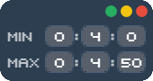

# ⏰random-interval-timer




Random interval timer with a beep sound, ranging from a minimum of **1 second** to a maximum of **99 hours, 59 minutes, and 59 seconds**

Created almost entirely by AI, so I take no responsibility for the code quality 🐸

## How to run
Once before running the app, you need to install the dependencies and build the project. After that, you can run the app without building it again.
```bash
npm i
npm run build
```

After the build is complete, you can run the app.
```bash
npm start
```

You may also start the app with dev mode.
```bash
npm run dev
```

To pack the app and get an .exe file, you can use the following command. The output will be in the `dist` folder.
```bash
npm run pack
```
